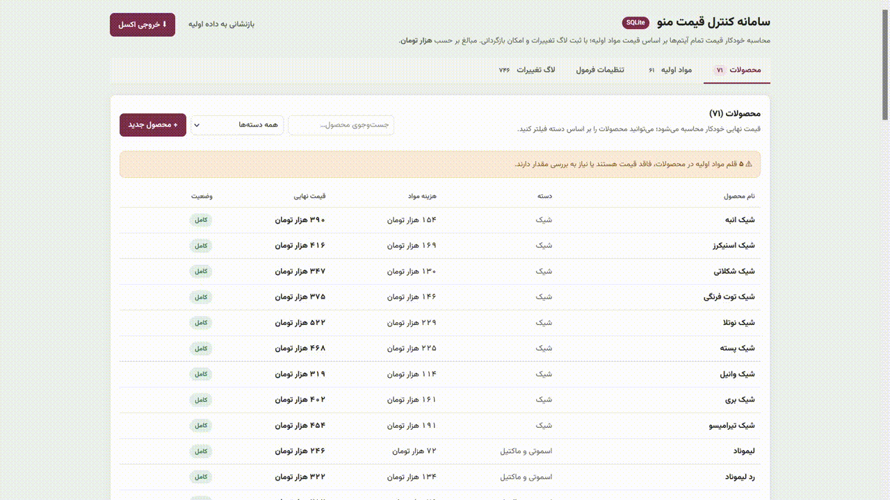

# ☕ سامانه کنترل قیمت منوی کافه

یک ابزار سبک و ساده برای **محاسبه و کنترل قیمت تمام‌شده آیتم‌های کافی‌شاپ** بر اساس مواد اولیه، هزینه‌ها، حاشیه سود و «سختی تهیه».



> مناسب برای کافه‌ها، رستوران‌های کوچک و هر کسب‌وکاری که می‌خواهد قیمت‌گذاری منو را منظم و قابل‌ردیابی انجام دهد.

## ✨ امکانات

- مدیریت **مواد اولیه** و قیمت خرید آن‌ها
- مدیریت **محصولات / آیتم‌های منو** و دستور تهیه هر محصول
- محاسبه خودکار قیمت تمام‌شده و قیمت نهایی
- اعمال درصد **ضایعات، سربار، بسته‌بندی، هزینه‌های دیگر و سود**
- سیستم **سختی تهیه از ۱ تا ۵**
  - سختی را می‌توان برای هر دسته‌بندی تعیین کرد.
  - هر محصول می‌تواند سختی اختصاصی خودش را داشته باشد و در این حالت از مقدار دسته‌بندی مستقل می‌شود.
  - درصد افزایش هر سطح سختی از تنظیمات قابل تغییر است.
- ثبت **لاگ تغییرات قیمت**
- جستجو و فیلتر محصولات و مواد اولیه
- خروجی اکسل
- ذخیره اطلاعات در **SQLite** در نسخه اصلی
- اجرای محلی بدون نیاز به فریم‌ورک یا پکیج جانبی Python
- یک **دموی مستقل و بدون دیتابیس** در فایل `index.html`

---

## 🖥️ دمو آنلاین

نسخه دمو است و **هیچ Python، SQLite یا سروری نیاز ندارد**.

برای مشاهده کلیک کنید:

[مشاهده دمو](https://mohnamdar.github.io/RecipeCost/)

اگر پروژه را روی GitHub Pages منتشر کنید، همین فایل به‌عنوان صفحه اصلی پروژه اجرا می‌شود.

### نکته مهم درباره دمو

دمو از `localStorage` مرورگر استفاده می‌کند؛ بنابراین تغییراتی که در دمو انجام می‌دهید فقط در همان مرورگر ذخیره می‌شوند و به دیتابیس نسخه اصلی ارتباطی ندارند.

---

## 🚀 نصب نسخه اصلی

نسخه اصلی برای استفاده محلی روی ویندوز طراحی شده است.

### پیش‌نیاز

- Python 3

هیچ پکیج جانبی Python لازم نیست.

### اجرا

فایل زیر را اجرا کنید:

```text
run.bat
```

سپس مرورگر روی آدرس زیر باز می‌شود:

```text
http://127.0.0.1:4500
```

در اولین اجرا، فایل `pricing.db` به‌صورت خودکار ساخته می‌شود.

### بکاپ

برای تهیه نسخه پشتیبان، کافی است فایل زیر را کپی کنید:

```text
pricing.db
```

---

## 🧮 منطق قیمت‌گذاری

قیمت نهایی محصول از ترکیب هزینه مواد اولیه و هزینه‌های تعریف‌شده در تنظیمات محاسبه می‌شود.

به‌صورت کلی:

```text
هزینه مواد اولیه
× (۱ + درصد ضایعات)
+ سربار
+ بسته‌بندی
+ سایر هزینه‌ها
= هزینه پایه

هزینه پایه
× ضریب سختی تهیه
= هزینه تعدیل‌شده

هزینه تعدیل‌شده
× (۱ + حاشیه سود)
= قیمت نهایی
```

### سختی تهیه

به‌صورت پیش‌فرض:

| سختی | افزایش |
|---:|---:|
| ۱ | ۰٪ |
| ۲ | ۱۰٪ |
| ۳ | ۲۰٪ |
| ۴ | ۳۰٪ |
| ۵ | ۴۰٪ |

درصد هر سطح از بخش **تنظیمات فرمول** قابل تغییر است.

---

## 📁 ساختار پروژه

```text
.
├── index.html              # دمو مستقل و بدون دیتابیس
├── app.py                  # سرور محلی نسخه اصلی
├── run.bat                 # اجرای سریع در ویندوز
├── templates/
│   └── index.html          # رابط نسخه اصلی
├── LICENSE                 # مجوز MIT
├── README.md
└── .gitignore
```

> `pricing.db` عمداً داخل Git قرار نمی‌گیرد و در اولین اجرای نسخه اصلی ساخته می‌شود.

---

## 🧪 تفاوت نسخه اصلی و دمو

| مورد | نسخه اصلی | دمو |
|---|---|---|
| دیتابیس | SQLite | ندارد |
| سرور Python | دارد | ندارد |
| ذخیره اطلاعات | `pricing.db` | `localStorage` |
| قابل اجرا در GitHub Pages | ❌ | ✅ |
| داده نمونه | ندارد | دارد |
| مناسب استفاده واقعی | ✅ | برای تست و معرفی |

نسخه اصلی عمداً **بدون محصول و ماده اولیه پیش‌فرض** شروع می‌شود تا اطلاعات واقعی کاربر با داده‌های نمونه مخلوط نشود.

---

## 📌 شروع کار با نسخه اصلی

بعد از اجرای برنامه:

1. ابتدا مواد اولیه را وارد کنید.
2. قیمت خرید و مقدار خرید هر ماده را ثبت کنید.
3. محصولات منو را ایجاد کنید.
4. مواد اولیه و مقدار مصرف هر محصول را مشخص کنید.
5. هزینه‌های فرمول و حاشیه سود را تنظیم کنید.
6. سختی تهیه دسته‌بندی‌ها را در صورت نیاز تعیین کنید.
7. قیمت نهایی محصولات را بررسی کنید.

---

## 🔐 مجوز

این پروژه تحت **MIT License** منتشر شده و استفاده، تغییر، کپی و توزیع آن مطابق شرایط این مجوز آزاد است.

جزئیات کامل در فایل [`LICENSE`](LICENSE) قرار دارد.

---

## 👤 سازنده

**created by [Mohamad Namdar](https://mohnam.ir)**

---

## ⭐ مشارکت

اگر پروژه برایتان مفید بود، می‌توانید به آن ⭐ بدهید یا با پیشنهاد، گزارش باگ و Pull Request به بهتر شدن آن کمک کنید.
